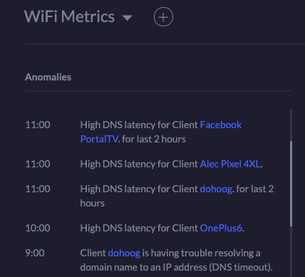

# DoHoT: making practical use of DNS over HTTPS over Tor

This is the first document for a new project called `DoHoT` DNS, which I
hope will grow to help people recoup some privacy in places where they
have previously not considered it lacking.

## Goals

What I seek with this project is to explain, to encourage, and to
simplify adoption of DNS over HTTPS over Tor.

## Presentation & Documentation: A Year of DNS over HTTPS over Tor

Presented at [NDSS21 DNS Privacy Workshop](https://www.ndss-symposium.org/ndss-program/dns-privacy-2021/)

* [paper](papers/no-port-53-who-dis-paper-3.1.pdf)
* [presentation](papers/no-port-53-who-dis-presentation-2.0.pdf)
* [youtube video](https://www.youtube.com/watch?v=wggz3CcctO0&t=3445s)

## Disclaimers

* Likely none of this is new.
* I probably describe nothing that is novel.
* Other people will have done this before, and are probably doing it
  now, although arguably from a base of less experience than myself
  regarding Tor and performance tuning.
* None of the software I describe has been written by me, but instead
  has been written by people cleverer and more dedicated than I.
* DNS experts will almost certainly describe the latency figures that
  I publish here as "excessively slow", "impractical", or
  "unusable". I firmly disagree, at least for the domestic or
  individual user, and I present several months' worth of both numbers
  and "24x7 lived experience" to back up my perspective.

## Why DoHoT?

The DNS protocol is more than 40 years old, was never designed for
privacy, and is broadly instrumented - i.e.: logged, sold, spied-upon,
and interfered-with - by:

1. Cafes, Hotels, Aircraft, and other "captive portals"
2. Internet Service Providers (ISPs)
3. The upstream peers and bearer-providers for ISPs
4. Partner-companies to the above, which monetise the ability to
   control, manipulate and track DNS results
5. Nation-state Governments which want to exert control upon peoples'
   access to information

As I have written
[elsewhere](https://medium.com/@alecmuffett/why-every-privacy-activist-should-embrace-dns-over-https-a361e727657f)
the launch of the `DoH` protocol presents a marvellous opportunity;
the protocol itself has been represented as rather
[contentious](https://www.theregister.co.uk/2019/09/24/mozilla_backtracks_doh_for_uk_users/)
but a careful reading of some of the more
[critical](https://www.eset.com/blog/business/the-battle-for-dns-and-data/)
[coverage](https://www.theregister.co.uk/2018/10/23/paul_vixie_slaps_doh_as_dns_privacy_feature_becomes_a_standard/)
suggests that the criticisms tend to come from people or organisations
in categories 2 through 5 above, perhaps concerned that
increased DNS privacy may impact their business models, revenue,
income, or their quiet "obligations" to nation-state security
services.  as if people being enabled with privacy would somehow be
"their fault".

### DoH as an Opportunity

Some critics ignore the "first mile" transport-security benefits of
`DoH` and instead [frame the concerns](https://www.zdnet.com/article/dns-over-https-causes-more-problems-than-it-solves-experts-say/)
by complaining about problems that `DoH` doesn't actually address; for
instance:

[ZDnet article](https://www.zdnet.com/article/dns-over-https-causes-more-problems-than-it-solves-experts-say/):
> The response to DoH's anointment as a major privacy-preserving
> solution has been downright acid, in some cases. Critics have taken
> a jab at the protocol on different plains, which we'll try to
> organize and categorize below:
>
> * DoH doesn't actually prevent ISPs user tracking
> * DoH creates havoc in the enterprise sector
> * DoH weakens cyber-security
> * DoH helps criminals
> * DoH shouldn't be recommended to dissidents
> * DoH centralizes DNS traffic at a few DoH resolvers

The cited criticisms are not reasonable because the concerns that are
raised are generally not for `DoH` to fix:

#### "DoH doesn't actually prevent ISPs user tracking"

`DoH` was never meant as a wholesale "cure" for ISP user-tracking;
it's meant to reduce DNS observation, tampering, and interference.

#### "DoH creates havoc in the enterprise sector"

I have worked in the "enterprise sector" since 1992; I am sorry to be
glib but this equally glib claim is nonsense.

#### "DoH weakens cyber-security"

Again this is a vague concern - DoH weakens what aspects of security,
how, for whom, and to what compensating benefits, to whom? - but also
it should be noted that the prime weaknesses in cybersecurity are
"users" and "software" yet we are somehow content to have more of both
of those?

#### "DoH helps criminals"

Helps criminals? So does "the internet" in general - it would not be
able to have cybercrime without computers.

#### "DoH shouldn't be recommended to dissidents"

So far as I am aware, nobody is recommending `DoH` for "dissidents";
`DoH` is being recommended more broadly to *people who want more privacy*.

#### "DoH centralizes DNS traffic at a few DoH resolvers"

Aha! This latter concern has some substance, and it is worth
consideration; generally there are three aspects to this concern:

1. "DNS is a 'distributed' protocol, and `DoH` is antithetical to 'distribution'!".
  * I deal with this matter extensively in a separate
    [blogpost](https://medium.com/@alecmuffett/why-every-privacy-activist-should-embrace-dns-over-https-a361e727657f)
2. "There are not enough `DoH` providers and users may be deanonymised via analysis of huge data sets!"
  * Mozilla has sought to address this concern with their
    [Trusted Recursive Resolver](https://wiki.mozilla.org/Trusted_Recursive_Resolver) program;
    but simplistically it seems logical that the proper solution to "too
    few" `DoH` providers is to encourage *more* of them, not *fewer*.
3. "A small number of *Big Data Companies* will get all the tracking information, instead of us!"
  * This is an actionable concern, and one where we can make an improvement well beyond `DoH` let alone `Do53`.

The fear that "Big Data Companies" will mine `DoH` request data for
profit is valid and is one which the likes of (e.g.)  Mozilla are
already working on
([see point 2, here](https://blog.mozilla.org/netpolicy/2020/02/25/the-facts-mozillas-dns-over-https-doh/)) -
but it's one where the internet is also already equipped with a well-tested solution:
[Tor](https://www.torproject.org).

### Why Tor, and why use DoH over Tor?

One of the goals of the Tor project is to provide anonymity of clients
from servers; there are *other* benefits to Tor and Tor "Onion
Networking", but this is the most popular rationale for Tor's use.

It's also a rationale which meshes insanely well, with `DoH`.

Tor does not support UDP and therefore cannot provide anonymity for
`Do53` traffic, but because `DoH` is normal HTTPS it can be carried
efficiently over Tor connections.

Therefore:

* if the individual provides and controls a local `Do53` resolver,
  not least for normal, "legacy" use - being offered by DHCP, etc.
* and that resolver is configured to resolve upstream, using `DoH`
* and that resolver is configured to strip linkable identifiers from `DoH` requests
* and that resolver connects to various major `DoH` providers over Tor
* then the provider will not know who is making the request, nor from where it came, nor will be able to "link" requests

This architecture follows Tor's
["anonymity loves company"](https://www.freehaven.net/doc/wupss04/usability.pdf)
model for privacy, and **offers far better privacy, integrity,
unblockability and untrackability than anything** offered by `Do53`,
`DoT` (DNS over TLS on port 853), raw `DoH` or indeed any other DNS
lookup-service.

And the technology already exists, is free, and my data and experience is that it
works really well for home users, perhaps more.

## How do I build a DoHoT server?

[See here](INSTALL.md); this project is project evolving and I will be updating it.

## Surely there have been some issues?

There are a few patterns or weird experiences that I have noted:

### The Ubiquity WiFi dashboard will complain about "latency", indefinitely

My WiFi router dashboard perpetually complains about "High DNS
Latency", which only goes to show that expectations of "low latency"
in modern DNS are lower than what humans are actually okay with.

### Chromecast honours DHCP's DoHoT DNS server, but also tries to use 8.8.8.8

Approximately every 20 seconds my Chromecast attempts to send a
request to 8.8.8.8, which my firewall drops and logs. I find this
interesting, but it's not really a DoHoT problem so much as a matter
of my choice to block any non-DoHoT DNS requests.

The Chromecast - including upgrades - still works fine, so I am
ignoring this matter.

### "Human Error" is surprisingly common

Every so often I visit somewhere that causes me to temporarily
hardcode my laptop or phone DNS server to 1.1.1.1 or 8.8.8.8; then I
come home and the device stops working until I remember to reset the
DNS to be the automatic DHCP default.

Again I consider this to be due to my choice to block any non-DoHoT DNS requests, but it's probably
also good discipline from a privacy perspective.  I actually used to believe that my privacy self-discipline was better than this, but I was wrong.

This situation is interesting to compare to criticism from DoH
critics who argue that it is they - your service provider, your
ISP - rather than you, who should be limiting access to alternative
sources of DNS resolution.

### Nothing at home is using Port 853

`DoT` / DNS-over-TLS on port 853 is touted by DNS experts as the "proper" solution
for DNS privacy and security, but I have not yet seen any devices or
applications actually using it.
